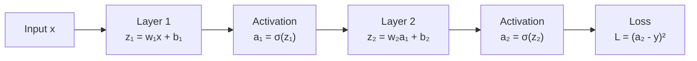
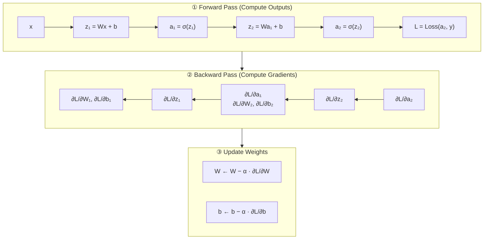
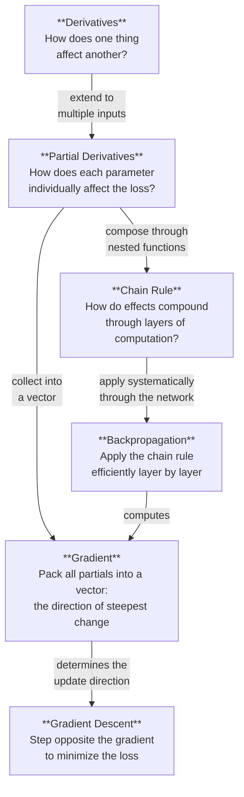

# Calculus for Machine Learning: From Derivatives to Backpropagation

> [!NOTE]
> This guide builds each concept on the previous one. By the end, you'll see how **derivatives → partial derivatives → chain rule → gradients** form the engine of backpropagation — the algorithm that makes neural networks learn.

---

## 1. Derivatives — "How Sensitive Is the Output to This Input?"

### The Core Intuition

Forget the textbook limit definition for a moment. A derivative answers one practical question:

> **If I nudge the input by a tiny amount, how much does the output change?**

Think of a thermostat. You turn the dial (input) and the room temperature changes (output). The derivative tells you: *for every degree I turn the dial, how many degrees does the room temperature change?*

### Formally

For a function $f(x)$:

$$f'(x) = \frac{df}{dx} = \lim_{h \to 0} \frac{f(x + h) - f(x)}{h}$$

But in practice, think of it as:

$$\frac{df}{dx} \approx \frac{\text{tiny change in output}}{\text{tiny change in input}}$$

### Example: $f(x) = x^2$

| $x$ | $f(x) = x^2$ | $f'(x) = 2x$ | Interpretation |
|-----|---------------|---------------|----------------|
| 1   | 1             | 2             | Nudge $x$ by 0.01 → output changes by ≈ 0.02 |
| 3   | 9             | 6             | Nudge $x$ by 0.01 → output changes by ≈ 0.06 |
| 5   | 25            | 10            | Nudge $x$ by 0.01 → output changes by ≈ 0.10 |

**Key insight for ML:** The derivative tells us the **rate of change**. When training a model, we want to know: *if I slightly adjust this weight, how does the loss change?* That's a derivative.

### Common Derivatives You'll Meet in ML

| Function | Derivative | Where It Shows Up |
|----------|------------|-------------------|
| $x^n$ | $nx^{n-1}$ | Polynomial features |
| $e^x$ | $e^x$ | Softmax, exponential families |
| $\ln(x)$ | $1/x$ | Log-loss / cross-entropy |
| $\sigma(x) = \frac{1}{1+e^{-x}}$ | $\sigma(x)(1 - \sigma(x))$ | Sigmoid activation |
| $\tanh(x)$ | $1 - \tanh^2(x)$ | Tanh activation |
| $\text{ReLU}(x) = \max(0, x)$ | $\begin{cases} 1 & x > 0 \\ 0 & x < 0 \end{cases}$ | ReLU activation |

> [!TIP]
> Notice how the sigmoid derivative $\sigma(x)(1-\sigma(x))$ is always between 0 and 0.25. This means gradients get **squished** as they flow through sigmoid layers — that's the **vanishing gradient problem**. ReLU's derivative is either 0 or 1, which is why it largely solved this problem.

---

## 2. Partial Derivatives — "Which Knob Matters Most?"

### The Core Intuition

Real ML models don't have just *one* input — they have millions of weights. A partial derivative answers:

> **If I nudge *just this one* input while keeping everything else fixed, how does the output change?**

Imagine a mixing board in a music studio with 100 sliders. A partial derivative tells you what happens to the overall sound when you move **one specific slider** while all others stay put.

### Formally

For $f(x, y) = x^2 + 3xy + y^2$:

$$\frac{\partial f}{\partial x} = 2x + 3y \quad \text{(treat } y \text{ as a constant)}$$

$$\frac{\partial f}{\partial y} = 3x + 2y \quad \text{(treat } x \text{ as a constant)}$$

The symbol $\partial$ (the "curly d") just means "partial" — we're differentiating with respect to one variable at a time.

### ML Example: Linear Regression Loss

Consider the mean squared error for a single data point with prediction $\hat{y} = wx + b$:

$$L(w, b) = (\hat{y} - y)^2 = (wx + b - y)^2$$

We need to know how to adjust both $w$ and $b$:

$$\frac{\partial L}{\partial w} = 2(wx + b - y) \cdot x \quad \text{→ "How sensitive is the loss to the weight?"}$$

$$\frac{\partial L}{\partial b} = 2(wx + b - y) \quad \text{→ "How sensitive is the loss to the bias?"}$$

These tell us which direction to move $w$ and $b$ to **reduce the loss**.

> [!IMPORTANT]
> Every time you see a neural network "learning," it's computing partial derivatives of the loss with respect to every single parameter. A model with 1 billion parameters computes 1 billion partial derivatives per training step.

---

## 3. The Chain Rule — "How Do Effects Ripple Through a Pipeline?"

### The Core Intuition

The chain rule is *the* key insight for deep learning. It answers:

> **If A affects B, and B affects C, how does A affect C?**

Think of a Rube Goldberg machine: you push a domino (A), which hits a ball (B), which rings a bell (C). The chain rule says: the total effect of the domino on the bell = (effect of domino on ball) × (effect of ball on bell).

### Formally

If $y = f(g(x))$, then:

$$\frac{dy}{dx} = \frac{dy}{dg} \cdot \frac{dg}{dx}$$

Or more intuitively: **"outer derivative × inner derivative"**

### Example: $y = (3x + 2)^2$

Let $g = 3x + 2$ (inner function), and $y = g^2$ (outer function):

$$\frac{dy}{dx} = \underbrace{2g}_{\text{outer derivative}} \cdot \underbrace{3}_{\text{inner derivative}} = 2(3x+2) \cdot 3 = 6(3x+2)$$

### Why This Matters: A Neural Network IS a Chain of Functions

A neural network is literally a composition of functions:



Mathematically: $L = f_5(f_4(f_3(f_2(f_1(x)))))$

To find how $w_1$ affects the loss, the chain rule gives us:

$$\frac{\partial L}{\partial w_1} = \frac{\partial L}{\partial a_2} \cdot \frac{\partial a_2}{\partial z_2} \cdot \frac{\partial z_2}{\partial a_1} \cdot \frac{\partial a_1}{\partial z_1} \cdot \frac{\partial z_1}{\partial w_1}$$

Each factor is simple on its own. The chain rule lets us **multiply simple derivatives together** to get the derivative through arbitrarily deep networks.

### Concrete Walkthrough

Let's compute each piece for a concrete network with $x = 1$, $y = 0$, $w_1 = 0.5$, $b_1 = 0.1$, $w_2 = 0.3$, $b_2 = 0.2$:

**Forward pass (compute outputs left to right):**

| Step | Computation | Value |
|------|-------------|-------|
| $z_1 = w_1 x + b_1$ | $0.5(1) + 0.1$ | $0.6$ |
| $a_1 = \sigma(z_1)$ | $\sigma(0.6)$ | $0.6457$ |
| $z_2 = w_2 a_1 + b_2$ | $0.3(0.6457) + 0.2$ | $0.3937$ |
| $a_2 = \sigma(z_2)$ | $\sigma(0.3937)$ | $0.5971$ |
| $L = (a_2 - y)^2$ | $(0.5971 - 0)^2$ | $0.3565$ |

**Backward pass (compute derivatives right to left):**

| Step | Computation | Value |
|------|-------------|-------|
| $\frac{\partial L}{\partial a_2} = 2(a_2 - y)$ | $2(0.5971)$ | $1.1942$ |
| $\frac{\partial a_2}{\partial z_2} = \sigma(z_2)(1 - \sigma(z_2))$ | $0.5971 \times 0.4029$ | $0.2406$ |
| $\frac{\partial z_2}{\partial a_1} = w_2$ | | $0.3$ |
| $\frac{\partial a_1}{\partial z_1} = \sigma(z_1)(1 - \sigma(z_1))$ | $0.6457 \times 0.3543$ | $0.2288$ |
| $\frac{\partial z_1}{\partial w_1} = x$ | | $1.0$ |

**Chain them together:**

$$\frac{\partial L}{\partial w_1} = 1.1942 \times 0.2406 \times 0.3 \times 0.2288 \times 1.0 = 0.0197$$

This means: *if we increase $w_1$ by 0.01, the loss increases by approximately 0.000197.* So to **decrease** the loss, we should **decrease** $w_1$.

---

## 4. The Gradient — "The Direction of Steepest Ascent"

### The Core Intuition

A gradient is simply **all the partial derivatives packed into a vector**. It answers:

> **What is the single best direction to move (across all parameters simultaneously) to increase the function the fastest?**

Imagine you're standing on a hilly landscape in fog and want to find the lowest valley. The gradient is an arrow pointing **uphill** in the steepest direction. So you walk in the **opposite** direction of the gradient — that's gradient descent.

### Formally

For $f(w_1, w_2, ..., w_n)$, the gradient is:

$$\nabla f = \begin{bmatrix} \frac{\partial f}{\partial w_1} \\ \frac{\partial f}{\partial w_2} \\ \vdots \\ \frac{\partial f}{\partial w_n} \end{bmatrix}$$

### The Gradient Descent Update Rule

$$w_{\text{new}} = w_{\text{old}} - \alpha \cdot \nabla L$$

Where:
- $\alpha$ = **learning rate** (how big a step to take)
- $\nabla L$ = gradient of the loss (direction of steepest **ascent**)
- The minus sign means we go **downhill** (reducing loss)

### Geometric Picture

```
Loss Surface (2D slice)

     Loss ↑
      │  ╱╲
      │ ╱  ╲          ← gradient points uphill
      │╱    ╲
      ╱      ╲
     ╱ ●→     ╲       ← we move OPPOSITE to gradient (downhill)
    ╱   step    ╲
   ╱             ╲
  ╱       ★       ╲   ← minimum (goal)
 ╱─────────────────╲──── w →
```

> [!TIP]
> **Learning rate intuition:** Too large and you overshoot the valley. Too small and you take forever. Adaptive optimizers like Adam adjust the learning rate per-parameter based on gradient history.

---

## 5. Putting It All Together: Backpropagation

Backpropagation is not a new concept — it's just the **chain rule applied systematically** through the computation graph, from output back to input.

### The Key Insight

Computing derivatives forward (for each weight, trace its effect all the way to the loss) would require one forward pass per weight — impossibly expensive for millions of weights.

Backpropagation flips this: compute the loss once, then **share work** by passing derivatives backward. Each node only needs to multiply the incoming derivative by its local derivative.

### The Algorithm



### The Beautiful Pattern

At every node during the backward pass, the same two-step pattern repeats:

1. **Receive** the gradient flowing in from the right (the "upstream gradient")
2. **Multiply** it by the local derivative (the "local gradient") to produce the gradient flowing out to the left

$$\text{outgoing gradient} = \text{incoming gradient} \times \text{local gradient}$$

That's the chain rule, applied one link at a time.

### Backprop in Five Lines of Pseudocode

```python
# Forward pass — compute and cache intermediate values
for layer in network.layers:
    x = layer.forward(x)  # stores input for backward pass

# Compute loss
loss = loss_fn(prediction, target)

# Backward pass — chain rule, layer by layer
grad = loss_fn.gradient(prediction, target)  # ∂L/∂prediction
for layer in reversed(network.layers):
    grad = layer.backward(grad)  # multiply by local derivative,
    # store ∂L/∂W for this layer,
    # pass ∂L/∂input to next layer
# Update
for layer in network.layers:
    layer.weights -= learning_rate * layer.weight_grad
```

---

## 6. The Full Picture: How It All Connects



### In One Sentence

> **Backpropagation uses the chain rule to efficiently compute the gradient of the loss with respect to every parameter, and gradient descent uses that gradient to update the parameters toward lower loss.**

---

## 7. Verify Your Understanding

Here are questions that test whether you've internalized the concepts:

| # | Question | Concept |
|---|----------|---------|
| 1 | If $f(x) = 3x^2$ and $x = 2$, what does $f'(2) = 12$ *mean*? | Derivative as sensitivity |
| 2 | For $L(w, b) = (wx + b - y)^2$, why do we compute $\partial L/\partial w$ and $\partial L/\partial b$ separately? | Partial derivatives |
| 3 | Why can't we just compute $\partial L/\partial w_1$ directly — why do we need the chain rule? | Chain rule necessity |
| 4 | Why do we subtract the gradient instead of adding it? | Gradient descent direction |
| 5 | Why is backprop more efficient than computing each weight's gradient independently? | Backprop efficiency |

### Answers

1. **It means:** if you increase $x$ from 2 by a tiny amount $\epsilon$, the output increases by approximately $12\epsilon$. It's the sensitivity of the output to the input at that point.

2. **Because** each parameter is an independent "knob" we can turn. We need to know which direction to turn *each* knob individually. The partial derivative isolates the effect of one knob.

3. **Because** $w_1$ doesn't directly touch the loss — its effect passes through several intermediate computations (linear transform → activation → next layer → ... → loss). The chain rule lets us track its influence through this entire pipeline.

4. **Because** the gradient points toward *increasing* the function (steepest ascent). We want to *decrease* the loss, so we go in the *opposite* direction.

5. **Because** backprop shares computation. The gradient at layer 5 is reused when computing gradients for layers 4, 3, 2, 1. Without this sharing, we'd redundantly recompute the same intermediate derivatives over and over. For $n$ parameters, backprop is $O(n)$ versus $O(n^2)$ for naïve computation.

---

> [!TIP]
> **Next step:** Try implementing a tiny neural network (2–3 layers) from scratch in NumPy, manually coding the forward and backward passes. There's no better way to cement these concepts than watching the numbers flow.
