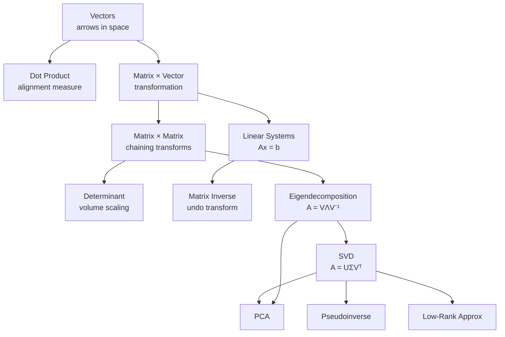

# Linear Algebra Fundamentals — An Intuitive Guide

> [!NOTE]
> This guide prioritizes **geometric intuition** and **practical understanding** over formal proofs. Every concept is accompanied by a "what it really means" section and NumPy code you can run.

---

## Table of Contents

1. [Vectors — Arrows, Not Just Numbers](#1-vectors)
2. [The Dot Product — Measuring Alignment](#2-dot-product)
3. [Matrices — Machines That Transform Space](#3-matrices)
4. [Matrix Multiplication — Chaining Transformations](#4-matrix-multiplication)
5. [Determinants — How Much Space Gets Stretched](#5-determinants)
6. [Linear Systems — Intersection of Constraints](#6-linear-systems)
7. [Eigenvalues & Eigenvectors — The Axes of a Transformation](#7-eigenvalues--eigenvectors)
8. [Singular Value Decomposition (SVD) — The Ultimate Factorization](#8-singular-value-decomposition)
9. [Cheat Sheet](#9-cheat-sheet)

---

## 1. Vectors

### What is a vector?

Forget the formal definition for now. A **vector** is an arrow in space. It has:

- A **direction** (where it points)
- A **magnitude** (how long it is)

We write a 2D vector as:

$$\vec{v} = \begin{bmatrix} 3 \\ 2 \end{bmatrix}$$

This means: "go 3 units right and 2 units up from the origin."

### The Three Ways to Think About Vectors

| Perspective | What a vector is | Used in |
|---|---|---|
| **Physics** | An arrow with direction & magnitude | Forces, velocity |
| **Computer Science** | An ordered list of numbers | Feature vectors, embeddings |
| **Mathematics** | An element of a vector space | Abstract algebra |

For ML and practical work, think of vectors as **lists of numbers where each position means something**.

### Vector Operations — Intuitively

**Addition** — Tip-to-tail chaining:
```
  →   →     →
  a + b  =  c

Place the tail of b⃗ at the tip of a⃗. The result c⃗ goes from the
tail of a⃗ to the tip of b⃗.
```

**Scalar Multiplication** — Stretching or shrinking:
```
2 × [3, 2] = [6, 4]     ← same direction, double the length
-1 × [3, 2] = [-3, -2]   ← reversed direction
```

**Magnitude (Length):**
$$\|\vec{v}\| = \sqrt{v_1^2 + v_2^2 + \dots + v_n^2}$$
This is just the Pythagorean theorem generalized to any number of dimensions.

**Unit Vector** — A vector with length 1. You get it by dividing a vector by its magnitude:
$$\hat{v} = \frac{\vec{v}}{\|\vec{v}\|}$$

### NumPy in Practice

```python
import numpy as np

# Creating vectors
v = np.array([3, 2])
w = np.array([1, 4])

# Addition
print(v + w)              # [4, 6]

# Scalar multiplication
print(2 * v)              # [6, 4]

# Magnitude
print(np.linalg.norm(v))  # 3.606

# Unit vector
print(v / np.linalg.norm(v))  # [0.832, 0.555]
```

### Key Insight

> [!IMPORTANT]
> In machine learning, a vector is a **point in feature space**. A 768-dimensional word embedding is a point in 768-dimensional space. The "direction" encodes meaning; the "distance" between vectors encodes similarity.

---

## 2. Dot Product

### What is the dot product?

The dot product of two vectors $\vec{a}$ and $\vec{b}$ is:

$$\vec{a} \cdot \vec{b} = a_1 b_1 + a_2 b_2 + \dots + a_n b_n$$

Mechanically, you multiply corresponding components and add them up.

### The Geometric Meaning — This Is the Important Part

$$\vec{a} \cdot \vec{b} = \|\vec{a}\| \cdot \|\vec{b}\| \cdot \cos\theta$$

where $\theta$ is the angle between the two vectors.

**What does this tell you?**

| Dot Product Value | Meaning | Angle |
|---|---|---|
| Positive & large | Vectors point in **similar** directions | θ < 90° |
| **Zero** | Vectors are **perpendicular** (orthogonal) | θ = 90° |
| Negative | Vectors point in **opposite** directions | θ > 90° |

### The "Projection" Intuition

The dot product $\vec{a} \cdot \vec{b}$ tells you **how much of $\vec{a}$ goes in the direction of $\vec{b}$**.

```
        a⃗
       ╱
      ╱
     ╱
    ╱ θ
   ╱___________  b⃗
   |← proj →|

   proj = (a⃗ · b̂) = ‖a⃗‖ cos θ
```

This is the **shadow** (projection) of $\vec{a}$ onto the line defined by $\vec{b}$.

### Why the Dot Product Matters Everywhere

- **Cosine similarity** in NLP: $\text{sim}(\vec{a}, \vec{b}) = \frac{\vec{a} \cdot \vec{b}}{\|\vec{a}\| \|\vec{b}\|}$
- **Neural network layers**: every neuron computes $\vec{w} \cdot \vec{x} + b$ — a dot product + bias
- **Orthogonality checks**: if $\vec{a} \cdot \vec{b} = 0$, they're independent

### NumPy in Practice

```python
a = np.array([1, 2, 3])
b = np.array([4, 5, 6])

# Dot product — three equivalent ways
print(np.dot(a, b))    # 32
print(a @ b)            # 32  (preferred modern syntax)
print(np.sum(a * b))    # 32  (element-wise multiply then sum)

# Cosine similarity
cos_sim = (a @ b) / (np.linalg.norm(a) * np.linalg.norm(b))
print(cos_sim)          # 0.9746
```

---

## 3. Matrices

### What is a matrix?

A matrix is a **rectangular grid of numbers**. But that's boring. Here's the insight:

> [!IMPORTANT]
> **A matrix is a transformation of space.**
>
> When you multiply a matrix by a vector, you're **moving that vector to a new position** — stretching, rotating, reflecting, or shearing the entire space.

### How to Read a Matrix

$$A = \begin{bmatrix} 2 & 0 \\ 0 & 3 \end{bmatrix}$$

Each **column** of the matrix tells you **where the corresponding basis vector lands**:

- Column 1: $\begin{bmatrix}2\\0\end{bmatrix}$ → the x-axis unit vector $\hat{i}$ gets stretched to $[2, 0]$
- Column 2: $\begin{bmatrix}0\\3\end{bmatrix}$ → the y-axis unit vector $\hat{j}$ gets stretched to $[0, 3]$

So this matrix **stretches** space: 2× horizontally, 3× vertically.

### Common 2D Transformation Matrices

```
Scaling:                    Rotation by θ:
┌         ┐                 ┌              ┐
│ sx   0  │                 │ cos θ  -sin θ│
│ 0   sy  │                 │ sin θ   cos θ│
└         ┘                 └              ┘

Reflection (over x-axis):  Shear:
┌         ┐                 ┌         ┐
│ 1    0  │                 │ 1    k  │
│ 0   -1  │                 │ 0    1  │
└         ┘                 └         ┘
```

### Matrix-Vector Multiplication — The Core Operation

When you compute $A\vec{v}$, you're asking: **"Where does $\vec{v}$ land after the transformation $A$?"**

$$\begin{bmatrix} 2 & 0 \\ 0 & 3 \end{bmatrix} \begin{bmatrix} 1 \\ 1 \end{bmatrix} = 1 \cdot \begin{bmatrix} 2 \\ 0 \end{bmatrix} + 1 \cdot \begin{bmatrix} 0 \\ 3 \end{bmatrix} = \begin{bmatrix} 2 \\ 3 \end{bmatrix}$$

**You're taking a linear combination of the columns of $A$, weighted by the components of $\vec{v}$.**

### Special Matrices

| Matrix | What it does |
|---|---|
| **Identity** $I$ | Does nothing — $I\vec{v} = \vec{v}$ |
| **Zero matrix** | Collapses everything to the origin |
| **Diagonal matrix** | Scales each axis independently |
| **Orthogonal matrix** ($Q^TQ = I$) | Pure rotation/reflection — preserves lengths |
| **Symmetric matrix** ($A = A^T$) | Has real eigenvalues, orthogonal eigenvectors |

### The Transpose — Swapping Rows and Columns

$$A = \begin{bmatrix} 1 & 2 & 3 \\ 4 & 5 & 6 \end{bmatrix} \quad \Rightarrow \quad A^T = \begin{bmatrix} 1 & 4 \\ 2 & 5 \\ 3 & 6 \end{bmatrix}$$

**Intuition**: The transpose mirrors the matrix across its main diagonal. Rows become columns, columns become rows.

**Key property**: $\vec{a} \cdot \vec{b} = \vec{a}^T \vec{b}$ — the dot product is just matrix multiplication with a transposed vector.

### NumPy in Practice

```python
A = np.array([[2, 0],
              [0, 3]])
v = np.array([1, 1])

# Matrix-vector multiplication
print(A @ v)         # [2, 3]

# Transpose
print(A.T)

# Identity matrix
I = np.eye(3)        # 3×3 identity

# Inverse (if it exists)
A_inv = np.linalg.inv(A)
print(A_inv @ A)     # ≈ Identity
```

---

## 4. Matrix Multiplication

### Why does matrix multiplication work the way it does?

Matrix multiplication $C = AB$ is **not** element-wise multiplication. Instead:

> **Multiplying two matrices means chaining two transformations.**
>
> $AB$ means: **first apply $B$, then apply $A$.**

### The Mechanics

For $C = AB$, each element $c_{ij}$ is the **dot product of row $i$ of $A$ with column $j$ of $B$**:

```
         B                         C
    ┌─────────┐               ┌─────────┐
    │ · · · · │               │         │
    │ · · · · │               │         │
A   │ · · · · │           A   │         │
┌───┤ · · · · │       ┌───┤   │    cᵢⱼ  │
│→→→│ · · · · │  =    │→→→│   │    ↑    │
└───┤         │       └───┤   │  dot    │
    │    ↓    │            │  product  │
    └─────────┘            └─────────┘

Row i of A  ·  Col j of B  =  element (i,j) of C
```

### Size Rules

$$\underset{(m \times \mathbf{n})}{A} \times \underset{(\mathbf{n} \times p)}{B} = \underset{(m \times p)}{C}$$

The **inner dimensions must match** ($n$). The result has the **outer dimensions** ($m \times p$).

### Key Properties

| Property | True? | Why it matters |
|---|---|---|
| $AB = BA$ (commutative) | ❌ **NO** | Rotation then scaling ≠ scaling then rotation |
| $A(BC) = (AB)C$ (associative) | ✅ Yes | You can group transformations |
| $A(B + C) = AB + AC$ (distributive) | ✅ Yes | |
| $(AB)^T = B^T A^T$ | ✅ Yes | The order reverses on transpose |

> [!WARNING]
> Matrix multiplication is **NOT commutative**. $AB \neq BA$ in general. This trips up everyone at first. Think about it: rotating then scaling gives a different result than scaling then rotating.

### NumPy in Practice

```python
A = np.array([[1, 2],
              [3, 4]])
B = np.array([[5, 6],
              [7, 8]])

# Matrix multiplication
C = A @ B            # preferred
C = np.matmul(A, B)  # equivalent
# C = np.dot(A, B)   # works but @ is clearer

print(C)
# [[19 22]
#  [43 50]]

# Verify: AB ≠ BA
print(A @ B)
print(B @ A)  # Different!
```

---

## 5. Determinants

### What is a determinant?

The determinant of a matrix tells you **how much the transformation scales area (or volume)**.

```
Before transformation:        After transformation by A:
┌──────┐                      ╱        ╲
│      │  area = 1           ╱   area   ╲
│      │                    ╱  = det(A)  ╲
└──────┘                    ╲            ╱
                             ╲          ╱
```

### For a 2×2 Matrix

$$\det\begin{bmatrix} a & b \\ c & d \end{bmatrix} = ad - bc$$

### What the Value Tells You

| det(A) value | Meaning |
|---|---|
| $\|det\| > 1$ | Transformation **expands** space |
| $\|det\| = 1$ | Transformation **preserves** area (rotations, reflections) |
| $0 < \|det\| < 1$ | Transformation **shrinks** space |
| $det = 0$ | Transformation **collapses a dimension** — the matrix is **singular** (not invertible) |
| $det < 0$ | Transformation **flips orientation** (like a mirror) |

> [!TIP]
> If $\det(A) = 0$, the matrix squashes space into a lower dimension. A 3D cube becomes a 2D pancake (or a 1D line, or a 0D point). This means information is lost and the transformation cannot be reversed — **no inverse exists**.

### NumPy in Practice

```python
A = np.array([[3, 1],
              [0, 2]])

print(np.linalg.det(A))  # 6.0 → area scales by 6×
```

---

## 6. Linear Systems

### What does $A\vec{x} = \vec{b}$ mean?

You're asking: **"What input vector $\vec{x}$, when transformed by $A$, lands on $\vec{b}$?"**

This is the same as asking: "What combination of the columns of $A$ gives me $\vec{b}$?"

### Solving It

If $A$ is invertible (det ≠ 0):

$$\vec{x} = A^{-1}\vec{b}$$

**Intuition**: $A^{-1}$ is the **reverse transformation**. If $A$ rotates 30° clockwise, $A^{-1}$ rotates 30° counter-clockwise.

### When Can't You Solve It?

If $\det(A) = 0$, the matrix collapses a dimension. You've lost information — you can't reverse the transformation. Either:
- **No solution** — $\vec{b}$ isn't in the collapsed output space
- **Infinite solutions** — many inputs map to the same output

### NumPy in Practice

```python
# Solve: 2x + y = 5, x + 3y = 7
A = np.array([[2, 1],
              [1, 3]])
b = np.array([5, 7])

x = np.linalg.solve(A, b)  # more stable than inv(A) @ b
print(x)  # [1.6, 1.8]
```

---

## 7. Eigenvalues & Eigenvectors

### The Big Idea

Most vectors change direction when you multiply them by a matrix. But some special vectors **only get scaled** — they keep pointing in the same direction (or exactly reverse). These are **eigenvectors**.

$$A\vec{v} = \lambda\vec{v}$$

- $\vec{v}$ is an **eigenvector** — a direction that doesn't change
- $\lambda$ (lambda) is an **eigenvalue** — how much it gets scaled

### Visual Intuition

```
Most vectors change direction:          Eigenvectors only stretch/shrink:

    →                    ↗                   →                    →→→
    v    ——[A]——>    Av                      v    ——[A]——>    λv
                   (rotated & scaled)                        (only scaled!)
```

### A Concrete Example

Consider the matrix $A = \begin{bmatrix} 3 & 1 \\ 0 & 2 \end{bmatrix}$

- Eigenvector $\vec{v}_1 = \begin{bmatrix}1\\0\end{bmatrix}$ with eigenvalue $\lambda_1 = 3$: the x-direction gets scaled by 3
- Eigenvector $\vec{v}_2 = \begin{bmatrix}-1\\1\end{bmatrix}$ with eigenvalue $\lambda_2 = 2$: this diagonal direction gets scaled by 2

**Every other vector is a mix of these two directions**, so it gets pulled unevenly and changes direction.

### Why Eigenvalues/Eigenvectors Matter

| Application | How eigen-decomposition helps |
|---|---|
| **PCA** (dimensionality reduction) | Eigenvectors of the covariance matrix = directions of maximum variance |
| **Google PageRank** | Dominant eigenvector of the link matrix = page importance scores |
| **Differential equations** | Eigenvalues determine stability (growing vs decaying solutions) |
| **Vibration analysis** | Eigenvalues = natural frequencies; eigenvectors = vibration modes |
| **Markov chains** | Eigenvector for λ=1 gives the steady-state distribution |

### The Eigendecomposition

If $A$ has $n$ linearly independent eigenvectors, you can decompose it as:

$$A = V \Lambda V^{-1}$$

where:
- $V$ = matrix whose columns are the eigenvectors
- $\Lambda$ = diagonal matrix of eigenvalues

**Intuition**: To understand what $A$ does:
1. **Change to the eigenvector coordinate system** ($V^{-1}$)
2. **Scale each axis independently** ($\Lambda$) — this is the simple part
3. **Change back** ($V$)

> [!TIP]
> The eigendecomposition reveals that every (diagonalizable) matrix is secretly just **stretching along special axes**. All the complexity is in *which* axes and *how much* stretching.

### For Symmetric Matrices (Extra Nice Properties)

If $A = A^T$ (symmetric), then:
- All eigenvalues are **real numbers** (not complex)
- Eigenvectors are **orthogonal** (perpendicular to each other)
- The decomposition becomes $A = Q\Lambda Q^T$ where $Q$ is orthogonal

This is why symmetric matrices appear everywhere in ML — covariance matrices, Hessians, kernel matrices are all symmetric.

### NumPy in Practice

```python
A = np.array([[3, 1],
              [0, 2]])

eigenvalues, eigenvectors = np.linalg.eig(A)
print("Eigenvalues:", eigenvalues)    # [3., 2.]
print("Eigenvectors (columns):\n", eigenvectors)

# Verify: A @ v = λ * v
v = eigenvectors[:, 0]   # first eigenvector
λ = eigenvalues[0]       # first eigenvalue
print("A @ v  =", A @ v)
print("λ * v  =", λ * v)  # should be the same!

# For symmetric matrices, use eigh (more stable):
S = np.array([[4, 2],
              [2, 3]])
eigenvalues, eigenvectors = np.linalg.eigh(S)

# Reconstruct: A = V @ diag(λ) @ V^(-1)
V = eigenvectors
Lambda = np.diag(eigenvalues)
A_reconstructed = V @ Lambda @ np.linalg.inv(V)
print("Reconstructed:\n", A_reconstructed)  # ≈ S
```

---

## 8. Singular Value Decomposition

### The Crown Jewel of Linear Algebra

SVD is arguably the most important matrix decomposition. It works on **any** matrix — any shape, any rank. Here's the decomposition:

$$A = U \Sigma V^T$$

where:
- $A$ is your $m \times n$ matrix
- $U$ is $m \times m$ orthogonal (columns = **left singular vectors**)
- $\Sigma$ is $m \times n$ diagonal (the **singular values** $\sigma_1 \geq \sigma_2 \geq \dots \geq 0$)
- $V^T$ is $n \times n$ orthogonal (rows = **right singular vectors**)

### The Three-Step Intuition

**Every matrix transformation, no matter how complex, is secretly three simple steps:**

```
    Input Space              Output Space

    ╭────╮     V^T        Σ         U       ╭────╮
    │    │  ────────→  ────────→  ────────→  │    │
    │    │   Rotate     Scale      Rotate    │    │
    ╰────╯   (align     (stretch   (align    ╰────╯
              to axes)   each       to final
                         axis)      position)
```

1. **$V^T$: Rotate** the input to align with special axes
2. **$\Sigma$: Scale** each axis independently (these are the singular values)
3. **$U$: Rotate** the result into the output space

> [!IMPORTANT]
> SVD says: *"Any linear transformation is equivalent to a rotation, followed by a scaling, followed by another rotation."*
> That's it. That's all any matrix can do.

### Singular Values vs Eigenvalues

| | Eigenvalues | Singular Values |
|---|---|---|
| Exist for | Square matrices only | **Any** matrix |
| Can be | Real, complex, negative, zero | Always **real and ≥ 0** |
| Vectors | May not be orthogonal | Always orthogonal |
| Interpretation | Scaling along eigenvector directions | Scaling along SVD axes |

**Connection**: The singular values of $A$ are the square roots of the eigenvalues of $A^T A$.

$$\sigma_i = \sqrt{\lambda_i(A^T A)}$$

### Applications — Why SVD Is Everywhere

#### 1. Low-Rank Approximation (Data Compression)

Keep only the top $k$ singular values and set the rest to zero:

$$A \approx U_k \Sigma_k V_k^T$$

```
Full SVD:         σ₁ = 10, σ₂ = 5, σ₃ = 0.1, σ₄ = 0.01
                   ████     ███     █           ·

Rank-2 approx:    σ₁ = 10, σ₂ = 5, σ₃ = 0,   σ₄ = 0
                   ████     ███     ·           ·

→ 95%+ of the information with half the components!
```

This is the mathematical basis for **image compression**, **PCA**, and **recommendation systems**.

#### 2. Image Compression Example

```python
from PIL import Image
import matplotlib.pyplot as plt

# Load grayscale image as matrix
img = np.random.rand(100, 100)  # placeholder — use a real image

U, S, Vt = np.linalg.svd(img, full_matrices=False)

# Reconstruct with only k singular values
k = 10
img_compressed = U[:, :k] @ np.diag(S[:k]) @ Vt[:k, :]

# Original: 100×100 = 10,000 values
# Compressed: 100×10 + 10 + 10×100 = 2,010 values (5× compression!)
```

#### 3. PCA Is Just SVD

Principal Component Analysis finds directions of maximum variance:

```python
# Center the data
X_centered = X - X.mean(axis=0)

# SVD of centered data
U, S, Vt = np.linalg.svd(X_centered, full_matrices=False)

# Principal components = rows of Vt (or columns of V)
# Singular values tell you the importance of each component
# Variance explained by component i: S[i]² / sum(S²)

variance_explained = (S ** 2) / np.sum(S ** 2)
print("Variance explained:", variance_explained)
```

#### 4. Pseudoinverse (Solving Unsolvable Systems)

When $A$ isn't square or isn't invertible, SVD gives you the **best approximate solution**:

$$A^+ = V \Sigma^+ U^T$$

where $\Sigma^+$ just takes the reciprocal of each nonzero singular value.

```python
# Overdetermined system (more equations than unknowns)
A = np.array([[1, 1], [1, 2], [1, 3]])
b = np.array([1, 2, 2])

# Least squares solution via pseudoinverse
x = np.linalg.pinv(A) @ b
# Equivalent to: x = np.linalg.lstsq(A, b, rcond=None)[0]
```

### NumPy in Practice

```python
A = np.array([[1, 2, 3],
              [4, 5, 6],
              [7, 8, 9]])

U, S, Vt = np.linalg.svd(A)

print("U (left singular vectors):\n", U)
print("S (singular values):", S)
print("Vt (right singular vectors):\n", Vt)

# Reconstruct A from SVD
A_reconstructed = U @ np.diag(S) @ Vt
print("Reconstructed:\n", A_reconstructed)  # ≈ A

# Rank of the matrix ≈ number of non-negligible singular values
rank = np.sum(S > 1e-10)
print("Rank:", rank)  # 2 (this matrix is rank-deficient!)
```

---

## 9. Cheat Sheet

### Concept Map



### Quick Reference

| Operation | NumPy | Meaning |
|---|---|---|
| Dot product | `a @ b` | How aligned are a and b? |
| Matrix × vector | `A @ v` | Transform v by A |
| Matrix × matrix | `A @ B` | Chain: first B, then A |
| Transpose | `A.T` | Swap rows ↔ columns |
| Inverse | `np.linalg.inv(A)` | Reverse transformation |
| Determinant | `np.linalg.det(A)` | Area/volume scaling factor |
| Eigenvalues | `np.linalg.eig(A)` | Axes & scale factors of A |
| SVD | `np.linalg.svd(A)` | Rotate → Scale → Rotate |
| Solve Ax=b | `np.linalg.solve(A, b)` | Find input that maps to b |
| Least squares | `np.linalg.lstsq(A, b)` | Best approximate solution |
| Pseudoinverse | `np.linalg.pinv(A)` | Generalized inverse via SVD |
| Rank | `np.linalg.matrix_rank(A)` | Number of independent dimensions |

### The "One Sentence" Summaries

| Concept | One sentence |
|---|---|
| **Vector** | A point/arrow in n-dimensional space |
| **Dot product** | Measures how much two vectors point in the same direction |
| **Matrix** | A function that transforms vectors (and therefore space) |
| **Matrix multiply** | Chaining two transformations into one |
| **Determinant** | How much a transformation scales area/volume (zero = collapse) |
| **Eigenvectors** | The directions a matrix doesn't rotate, only stretches |
| **Eigenvalues** | How much it stretches along those directions |
| **SVD** | Any transformation = rotate, scale, rotate |

---

> [!TIP]
> **Where to go next:**
> - **3Blue1Brown's "Essence of Linear Algebra"** — the best visual companion to everything above
> - **Practice**: Implement PCA from scratch using only NumPy and SVD
> - **Challenge**: Compress an image using SVD and vary $k$ to see quality vs compression tradeoffs
> - **ML connection**: Understand how `nn.Linear(in, out)` in PyTorch is just a matrix multiplication $W\vec{x} + \vec{b}$
